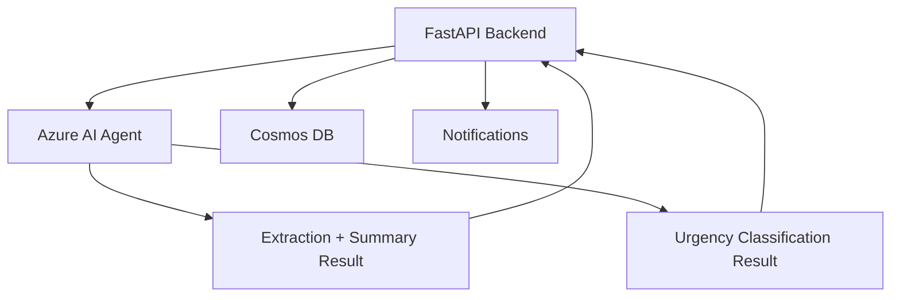
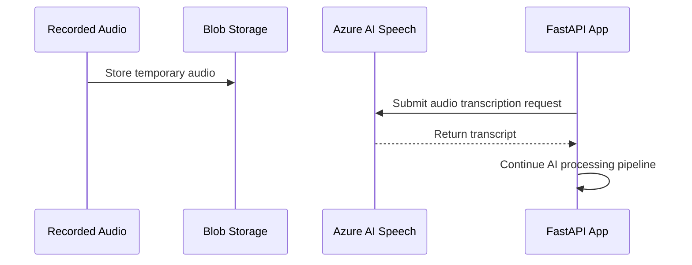
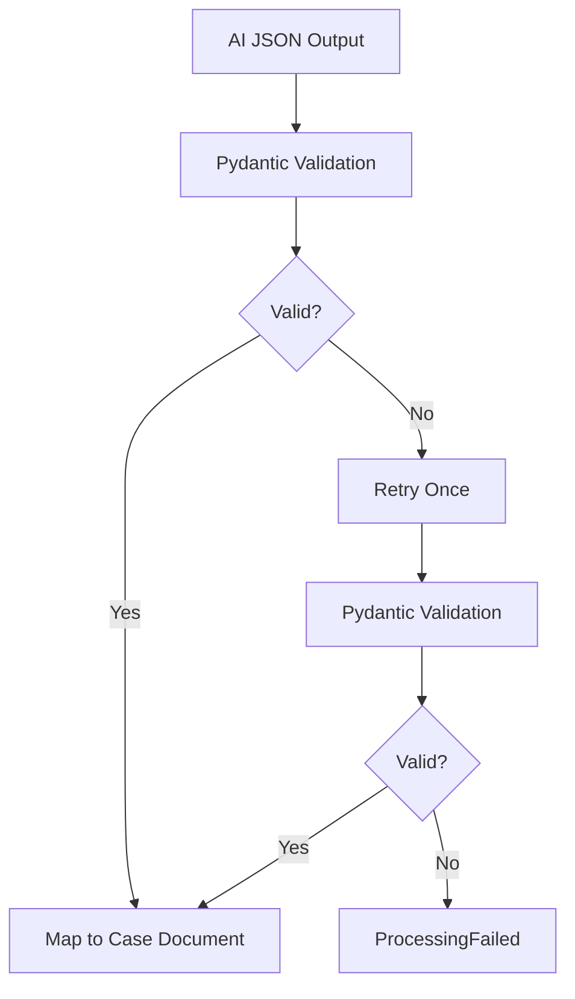

# Nurse Intake Assistant - AI-103 Mapping

## 1. Purpose

This document maps the Nurse Intake Assistant Phase 1 capstone MVP to Azure AI-103 exam-relevant skills. The project is not just an app build; it is designed to demonstrate Azure AI application development patterns using Azure AI Foundry, Azure AI Agents, Azure AI Speech, prompt engineering, structured output validation, responsible AI boundaries, monitoring, and deployment.

## 2. High-Level Exam Alignment

| AI-103 Area | Project Evidence |
|---|---|
| Develop generative AI apps in Azure | AI-assisted extraction, summarization, advisory urgency classification, structured JSON output, prompt validation |
| Develop AI agents on Azure | Azure AI Agent used for reasoning-only extraction/classification workflow |
| Develop natural language solutions | Intake transcript/text understanding, summarization, field extraction, classification |
| Develop speech-enabled solutions | Azure AI Speech transcription of recorded patient intake audio |
| Responsible AI and safety | Advisory-only urgency, nurse review required, no diagnosis, minimal PHI in notifications/logs |
| Monitoring and deployment | Application Insights, structured logs, Key Vault, managed identity, Bicep deployment |

## 3. Azure AI Foundry / Generative AI App Concepts

The project demonstrates a practical generative AI application pattern:

```text
Input text/transcript
→ prompt to model/agent
→ structured JSON output
→ Pydantic validation
→ retry if invalid
→ deterministic backend side effects
```

### Demonstrated Skills

- Selecting a model deployment for cost-conscious MVP development.
- Calling an Azure-hosted generative AI model or Azure AI Agent.
- Designing prompts for structured extraction.
- Designing prompts for summarization.
- Designing prompts for classification.
- Validating model output with a schema.
- Retrying invalid structured output once.
- Keeping business-critical side effects outside the model.

### Project Artifacts

- `ai_agent_service.py`
- `models/ai_outputs.py`
- `case_processing_service.py`
- Pydantic output models
- Prompt templates for extraction and urgency classification

## 4. Azure AI Agents Mapping

Phase 1 uses an Azure AI Agent for reasoning only. The agent receives transcript or typed intake content and returns structured results.



### Why This Is AI-103 Relevant

The project demonstrates agent integration without overusing agents for side effects. This is architecturally important because it separates:

| Agent Responsibility | Backend Responsibility |
|---|---|
| Reason over transcript/text | Persist case document |
| Extract structured fields | Send SMS/email |
| Summarize patient message | Delete temporary audio |
| Classify advisory urgency | Mark reviewed/retry |

This is a clean agent boundary for an MVP and avoids unsafe autonomous behavior.

## 5. Natural Language Processing Mapping

The patient intake message is natural language. The system must transform unstructured language into structured case data.

### NLP Tasks Demonstrated

| Task | Project Implementation |
|---|---|
| Field extraction | Extract patient name, DOB, callback number, reason, symptoms |
| Summarization | Generate brief nurse-facing case summary |
| Classification | Classify advisory urgency as Routine/Urgent |
| Missing data detection | Identify missing or uncertain required fields |
| Normalization | Map output to consistent case document shape |

### Example Output

```json
{
  "patient": {
    "name": "Jane Doe",
    "date_of_birth": "1980-04-15",
    "callback_number": "+15555550123"
  },
  "reason_for_calling": "Chest discomfort",
  "symptoms": ["chest discomfort", "shortness of breath"],
  "summary": "Patient reports chest discomfort and shortness of breath beginning this morning.",
  "missing_fields": [],
  "uncertain_fields": []
}
```

## 6. Azure AI Speech Mapping

The phone and demo audio paths demonstrate speech-enabled AI application development.



### Demonstrated Skills

- Taking recorded audio as an input source.
- Storing audio temporarily in Blob Storage.
- Calling Azure AI Speech for transcription.
- Handling transcription failures.
- Passing transcript into downstream generative AI pipeline.
- Deleting audio after successful processing.

### Phase 1 Boundary

Real-time speech and live voice bot behavior are out of scope. The project uses batch/file transcription because the intake model is a recorded message, not a live multi-turn conversation.

## 7. Responsible AI Mapping

Responsible AI is central to the architecture because the system touches healthcare-like intake data.

### Safety Decisions

| Concern | Design Response |
|---|---|
| AI could be mistaken | Urgency is advisory only; nurse review required |
| AI should not diagnose | Prompts and UI avoid diagnosis/medical advice language |
| Urgent symptoms could be missed | Combine red-flag rules with AI classification |
| Patient may describe emergency | Intake prompt says to call 911 for emergencies |
| PHI exposure | Minimal SMS, limited email, no PHI in logs, temporary audio deletion |
| Missing data | Create case anyway and mark `NeedsFollowUp` |

### Required UI Wording

Use wording like:

```text
Advisory urgency: Urgent. Nurse review required. This system does not provide diagnosis or medical advice.
```

Avoid wording like:

```text
Diagnosis: urgent condition
The patient requires emergency treatment
The AI determined the medical outcome
```

## 8. Prompt Engineering Mapping

The project requires at least two prompt categories.

### Extraction and Summary Prompt

Goal:

```text
Convert unstructured transcript or typed intake into structured patient intake fields and a brief nurse-facing summary.
```

Expected behavior:

- Return only JSON matching schema.
- Mark missing fields explicitly.
- Do not invent unknown details.
- Preserve uncertainty.
- Avoid clinical diagnosis.

### Urgency Classification Prompt

Goal:

```text
Classify the request as Routine or Urgent for nurse review, using advisory language only.
```

Expected behavior:

- Return only JSON matching schema.
- Include rationale.
- Include advisory disclaimer.
- Do not provide diagnosis or treatment advice.

## 9. Structured Output and Validation Mapping

AI-103-relevant applications should not blindly trust model text. This project validates AI output using Pydantic.



### Demonstrated Skills

- Schema-first AI output design.
- Runtime validation of generated output.
- Retry handling.
- Failure status handling.
- Human-review fallback.

## 10. Azure Storage and Data Mapping

Although AI-103 is AI-focused, the capstone also demonstrates practical Azure application architecture.

| Data Type | Storage |
|---|---|
| Temporary audio | Azure Blob Storage |
| Case document | Cosmos DB serverless |
| Secrets/configuration | Azure Key Vault |
| Operational telemetry | Application Insights |

This supports AI-103-adjacent skills around building deployable Azure AI applications rather than isolated model demos.

## 11. Monitoring and Observability Mapping

The project uses structured Application Insights logs.

### Log Events

```json
{
  "event": "IntakeReceived",
  "correlationId": "acs-recording-abc123",
  "sourceCallId": "acs-call-xyz789"
}
```

```json
{
  "event": "AiClassificationCompleted",
  "correlationId": "acs-recording-abc123",
  "ruleUrgency": "Urgent",
  "aiUrgency": "Routine",
  "finalUrgency": "Urgent"
}
```

```json
{
  "event": "NotificationFailed",
  "correlationId": "acs-recording-abc123",
  "channel": "sms",
  "failureReason": "ProviderError"
}
```

### Exam-Relevant Concepts

- Application telemetry.
- Correlation IDs.
- Failure tracking.
- Retry tracking.
- Avoiding sensitive content in logs.

## 12. Security and Deployment Mapping

The system demonstrates secure Azure app deployment patterns.

| Concept | Project Implementation |
|---|---|
| Managed identity | App Service uses managed identity to access Azure resources where practical |
| Secret management | Key Vault stores secrets and provider keys |
| App authentication | App Service Authentication with Microsoft Entra ID protects dashboard and demo forms |
| Infrastructure as code | Bicep provisions disposable dev resource group |
| Cost control | Cosmos DB serverless and delete/recreate resource group strategy |

## 13. AI-103 Study Value by Module Area

| Learning Objective | Covered by Project? | Evidence |
|---|---:|---|
| Build generative AI solutions | Yes | AI extraction, summary, classification |
| Use Azure AI Foundry | Yes | Project/model/agent integration |
| Build with Azure AI Agents | Yes | Reasoning-only agent boundary |
| Use prompt engineering | Yes | Two prompt types with structured output |
| Validate generated output | Yes | Pydantic schemas and retry |
| Use speech services | Yes | Azure AI Speech transcription |
| Apply responsible AI | Yes | Advisory-only, no diagnosis, nurse review |
| Deploy Azure AI app | Yes | FastAPI on App Service with Bicep |
| Monitor AI app | Yes | Application Insights structured logs |
| Visual data insights | No, not Phase 1 | Can be covered by separate mini-labs or Phase 2 document upload feature |

## 14. Gaps Not Fully Covered by Phase 1

Phase 1 does not deeply cover visual data extraction or Document Intelligence. This is intentional because the MVP is voice/text intake focused.

Recommended ways to cover the gap:

- Separate AI-103 mini-lab for image analysis.
- Separate AI-103 mini-lab for Document Intelligence.
- Phase 2 enhancement: nurse document upload with OCR/extraction/summarization.

## 15. Resume / Portfolio Framing

The project can be described as:

```text
Designed and built an Azure AI nurse intake assistant using FastAPI, Azure Communication Services, Azure AI Speech, Azure AI Foundry Agents, Cosmos DB, and Azure App Service. The system transcribes recorded patient calls, extracts structured intake fields, generates nurse-facing summaries, classifies advisory urgency using rules plus AI, stores case records, sends nurse notifications, and provides a protected dashboard for review and retry.
```

## 16. Interview Talking Points

Strong talking points:

- Why the agent is reasoning-only and does not perform side effects.
- Why urgency is advisory and backed by deterministic red-flag rules.
- Why structured output is validated with Pydantic before persistence.
- Why audio is temporary and deleted after successful processing.
- Why SMS content is minimized.
- Why FastAPI background tasks are acceptable for MVP but queues are better for production.
- Why Cosmos DB serverless fits low-volume capstone/demo usage.
- How the project maps to AI-103 objectives.

## 17. Future AI-103-Aligned Enhancements

Potential future enhancements:

- Queue-based durable processing with Azure Storage Queue or Service Bus.
- Azure Function worker for processing pipeline.
- Document upload processing with Azure AI Document Intelligence.
- Image/document analysis mini-lab integration.
- Multi-agent architecture with specialized intake, triage, document, and notification agents.
- Role-based dashboard authorization.
- More advanced monitoring and evaluation of AI outputs.
