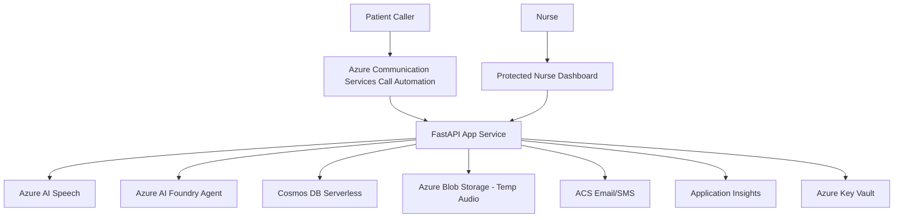
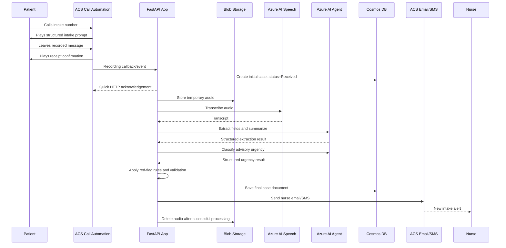
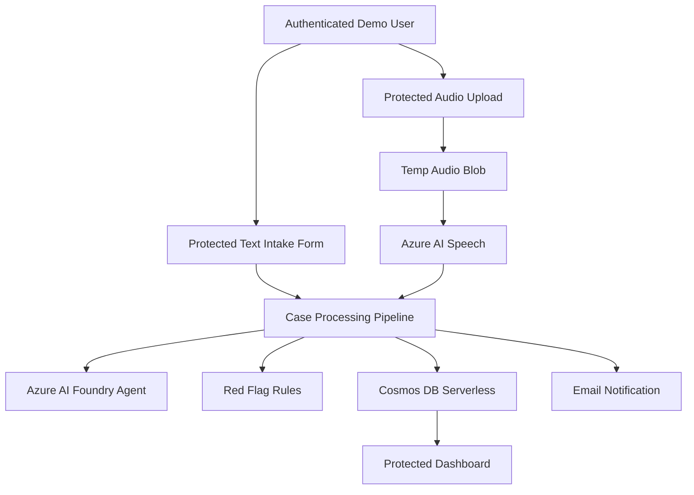
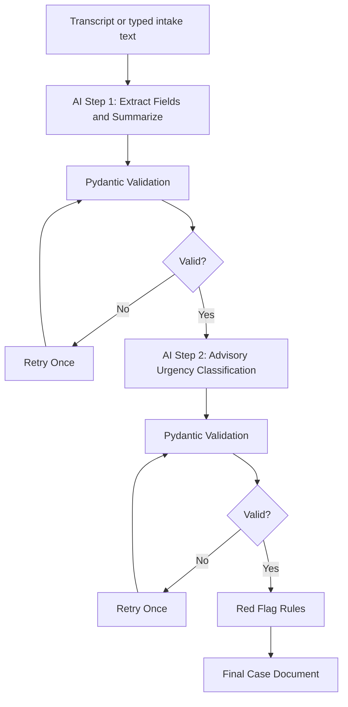
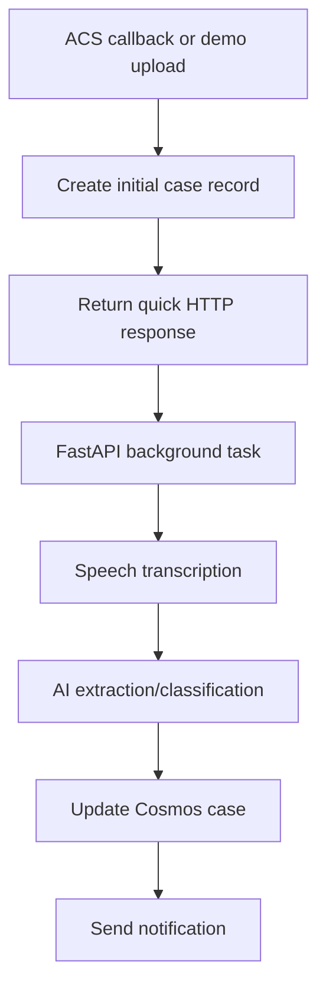

# Nurse Intake Assistant - Phase 1 Architecture

## 1. Purpose

The Nurse Intake Assistant is a Phase 1 capstone MVP that automates nurse intake documentation while preserving nurse judgment. The system collects patient intake information from a phone call or protected demo form, transcribes or processes the input, generates an AI-assisted summary, assigns an advisory urgency level, creates a case record, notifies the nurse, and provides a protected dashboard for review.

This architecture is intentionally MVP-oriented. It demonstrates Azure AI application and agent concepts without overbuilding production healthcare workflow, scheduling, RBAC, or enterprise compliance infrastructure.

## 2. Phase 1 Scope

### In Scope

- Structured phone intake using Azure Communication Services Call Automation.
- One recorded-message intake prompt rather than a live conversational voice bot.
- Required intake fields:
  - Patient name
  - Date of birth
  - Callback number
  - Reason for calling
  - Symptoms
- Azure AI Speech transcription for recorded audio.
- AI extraction, summarization, and advisory urgency classification through Azure AI Foundry / Azure AI Agent.
- Rules plus AI urgency classification.
- Case creation in Azure Cosmos DB serverless.
- Nurse notification by email and SMS for real ACS phone intake.
- Protected nurse dashboard with case list, detail page, mark-reviewed action, and retry processing action.
- Protected demo text intake form.
- Protected demo audio upload endpoint.
- Application Insights logging with correlation IDs and PHI-conscious logging.
- Bicep-managed disposable Azure resource group where practical.

### Out of Scope for Phase 1

- Production patient portal.
- Live conversational voice bot.
- Patient identity verification against an EHR or patient database.
- Clinical diagnosis or medical advice.
- Emergency dispatch or automated clinical triage.
- Nurse scheduling system integration.
- Role-based access control beyond authenticated dashboard access.
- Full HIPAA/compliance certification package.
- Queue-based durable worker architecture.
- Multi-agent production workflow.

## 3. Key Architecture Decisions

| Area | Phase 1 Decision |
|---|---|
| Phone intake style | Structured recorded-message intake |
| Telephony | Azure Communication Services Call Automation |
| Patient confirmation | Voice confirmation during call only |
| Speech transcription | Azure AI Speech batch/file transcription |
| AI processing | Two-step pipeline: extraction/summary, then urgency classification |
| AI orchestration | Azure AI Agent for reasoning only; backend owns side effects |
| Urgency | Rules + AI advisory classification |
| Storage | Cosmos DB serverless, one document per case |
| Temporary audio | Blob Storage temp container; delete after success; failed audio retained 48 hours |
| Dashboard | Single FastAPI app with server-rendered Jinja2 pages |
| Authentication | App Service built-in Authentication with Microsoft Entra ID |
| Notifications | Azure Communication Services Email + SMS |
| Background processing | FastAPI background task after quick request/callback acknowledgement |
| Retry | One automatic retry + one manual retry |
| Infrastructure | Bicep-managed disposable resource group |
| Documentation | Mermaid diagrams plus component tables |

## 4. System Context



| Component | Responsibility |
|---|---|
| Patient Caller | Calls the intake phone number and leaves a structured recorded message |
| Azure Communication Services Call Automation | Answers inbound calls, plays prompt, records patient message, emits recording callback |
| FastAPI App Service | Hosts callback endpoints, demo forms, dashboard, orchestration, validation, retry, and notification policy |
| Azure AI Speech | Converts recorded audio into transcript text |
| Azure AI Foundry Agent | Performs structured field extraction, summarization, and advisory urgency classification |
| Cosmos DB Serverless | Stores durable case documents |
| Blob Storage | Temporarily stores audio files for transcription and retry |
| ACS Email/SMS | Sends nurse notifications |
| Application Insights | Stores structured operational logs and correlation IDs |
| Key Vault | Stores secrets and configuration accessed by managed identity |

## 5. Phone Intake Data Flow



## 6. Demo Intake Data Flow



| Demo Path | Purpose |
|---|---|
| Protected text intake form | Demonstrates typed intake through the same AI, storage, notification, and dashboard pipeline without ACS phone dependency |
| Protected audio upload | Demonstrates audio transcription and downstream processing if ACS phone setup is blocked |
| SMS suppression for demo | Prevents noisy test SMS while still sending demo email notifications |

## 7. Intake Prompt and Patient Confirmation

The phone path uses a structured recorded-message model. The system does not conduct a live question-by-question conversation.

Example prompt:

```text
Please leave a message with your name, date of birth, callback number, reason for calling, and symptoms. A nurse will review your message and follow up. If this is an emergency, please call 911.
```

After recording, the patient hears:

```text
Thank you. Your message has been received. A nurse will review it and follow up. If this is an emergency, please call 911.
```

## 8. AI Processing Architecture



The backend remains responsible for orchestration, persistence, notifications, and audio deletion. The Azure AI Agent is used for reasoning and structured output only.

### AI Output Models

```python
from pydantic import BaseModel, Field
from typing import Literal

class PatientInfo(BaseModel):
    name: str | None = None
    date_of_birth: str | None = None
    callback_number: str | None = None

class ExtractionSummaryResult(BaseModel):
    patient: PatientInfo
    reason_for_calling: str | None = None
    symptoms: list[str] = Field(default_factory=list)
    summary: str
    missing_fields: list[str] = Field(default_factory=list)
    uncertain_fields: list[str] = Field(default_factory=list)
    extraction_notes: str | None = None

class UrgencyClassificationResult(BaseModel):
    urgency: Literal["Routine", "Urgent"]
    urgency_rationale: str
    advisory_disclaimer: str
```

## 9. Urgency Classification

The system uses a rules plus AI advisory model.

```text
Run red-flag rules
Run AI urgency classification
If rules say Urgent OR AI says Urgent:
    urgency = Urgent
Else:
    urgency = Routine
```

The urgency label is always advisory. The nurse remains responsible for clinical judgment and follow-up.

Example red-flag configuration:

```yaml
red_flags:
  - id: chest_pain
    label: Chest pain
    terms:
      - chest pain
      - chest pressure
      - tightness in chest
    urgency: Urgent

  - id: shortness_of_breath
    label: Shortness of breath
    terms:
      - shortness of breath
      - trouble breathing
      - can't breathe
    urgency: Urgent

  - id: stroke_symptoms
    label: Possible stroke symptoms
    terms:
      - face drooping
      - slurred speech
      - arm weakness
      - sudden confusion
    urgency: Urgent

  - id: severe_bleeding
    label: Severe bleeding
    terms:
      - severe bleeding
      - won't stop bleeding
      - bleeding heavily
    urgency: Urgent
```

## 10. Case Status Model

| Status Type | Values | Purpose |
|---|---|---|
| `processingStatus` | `Received`, `Transcribing`, `AiProcessing`, `Completed`, `RetryPending`, `ProcessingFailed` | Operational state of processing pipeline |
| `intakeStatus` | `Complete`, `NeedsFollowUp`, `ProcessingFailed` | Whether required intake data is usable/complete |
| `reviewStatus` | `New`, `Reviewed` | Nurse review lifecycle |
| `urgency` | `Routine`, `Urgent`, `Unknown` | Advisory prioritization |

If required data is missing or unclear, the system still creates a case and marks it `NeedsFollowUp`. Potentially urgent or incomplete messages are not discarded.

## 11. Cosmos DB Storage Model

Phase 1 uses Cosmos DB serverless. Each intake becomes one case document. The partition key is `/createdDate` using day-level granularity.

```json
{
  "id": "8c2f2b9e-4e28-4f26-b7fa-82b0e9c4d0e1",
  "caseNumber": "NI-20260621-143512-A7F3",
  "createdDate": "2026-06-21",
  "createdUtc": "2026-06-21T14:35:12Z",
  "caseType": "phone-intake",
  "sourceSystem": "AzureCommunicationServices",
  "sourceCallId": "acs-call-xyz789",
  "sourceRecordingId": "acs-recording-abc123",
  "idempotencyKey": "acs-recording-abc123",

  "patient": {
    "name": "Jane Doe",
    "dateOfBirth": "1980-04-15",
    "callbackNumber": "+15555550123"
  },

  "reasonForCalling": "Chest discomfort",
  "symptoms": ["chest discomfort", "shortness of breath"],
  "transcript": "Hi, my name is Jane Doe...",
  "summary": "Patient reports chest discomfort and shortness of breath.",

  "urgency": "Urgent",
  "urgencySource": "RulesAndAI",
  "matchedRedFlags": ["chest_pain", "shortness_of_breath"],
  "urgencyRationale": "Red-flag symptoms detected. Advisory only; nurse review required.",

  "intakeStatus": "Complete",
  "processingStatus": "Completed",
  "reviewStatus": "New",
  "queuePriority": 10,

  "missingFields": [],
  "uncertainFields": [],

  "notificationStatus": {
    "email": "Sent",
    "sms": "Sent"
  },

  "statusHistory": []
}
```

## 12. Case Numbering and Idempotency

Cases use both an internal GUID and a human-readable case number.

Recommended case number format:

```text
NI-{yyyyMMdd}-{HHmmss}-{shortRandomSuffix}
```

Example:

```text
NI-20260621-143512-A7F3
```

The idempotency key should use the ACS recording ID when available, with call ID as fallback.

```json
{
  "idempotencyKey": "acs-recording-abc123",
  "sourceSystem": "AzureCommunicationServices",
  "sourceCallId": "acs-call-xyz789",
  "sourceRecordingId": "acs-recording-abc123",
  "sourceEventType": "RecordingFileStatusUpdated"
}
```

Duplicate ACS callbacks should not create duplicate cases or duplicate notifications.

## 13. Dashboard Architecture

The dashboard is server-rendered by the same FastAPI application using Jinja2 templates. No React, Angular, Vue, or separate frontend is required for Phase 1.

### Dashboard Routes

```text
/dashboard
/dashboard/cases
/dashboard/cases/{case_id}
/cases/{case_id}/review
/cases/{case_id}/retry
```

### Protected Demo Routes

```text
/demo/intake/text
/demo/intake/audio-upload
```

### Webhook Routes

```text
/intake/acs/events
/intake/acs/recording-callback
/health
```

Webhook routes must not be blocked by dashboard authentication. They require separate validation where feasible, such as event validation, shared secret, or signed callback validation.

### Case List Columns

- Case number
- Created time
- Patient name
- Callback number
- Advisory urgency
- Intake status
- Review status
- Processing status

### Case Detail Sections

- Patient: name, DOB, callback number
- Intake: reason, symptoms, transcript, AI summary
- Advisory urgency: urgency, rationale, matched red flags
- Data quality: missing and uncertain fields
- Processing: status, retry count, failure reason
- Notifications: email/SMS status
- Review: status, reviewed timestamp, optional review note
- Timeline: status history

## 14. Queue Priority

Dashboard sorting should prioritize new cases as follows:

| Case Type | Queue Priority |
|---|---:|
| Urgent, Needs Follow-up | 10 |
| Urgent, Complete | 20 |
| Routine, Needs Follow-up | 30 |
| Routine, Complete | 40 |
| Processing Failed | 50 |
| Reviewed | 99 |

Default list behavior: today’s cases, `New` review status, urgent first.

## 15. Background Processing and Retry

Phase 1 uses FastAPI background tasks after quickly acknowledging ACS callbacks or demo upload requests.



This is an MVP compromise. It avoids queue infrastructure but is not as durable as Azure Storage Queue, Service Bus, or a worker service.

### Retry Policy

- One automatic retry after initial processing failure.
- Failure notification is sent only after automatic retry fails.
- One manual retry is available from the dashboard for `ProcessingFailed` or `Possibly Stuck` cases.
- Any authenticated dashboard user can retry processing.
- Manual retry success sends normal notification if not already sent.
- Manual retry failure sends/updates failure notification.

### Possibly Stuck Detection

A case is considered possibly stuck when:

```text
processingStatus IN ("Received", "Transcribing", "AiProcessing", "RetryPending")
AND lastStatusUpdatedUtc is older than 15 minutes
```

The dashboard computes this on page load. No scheduler is required for Phase 1.

## 16. Audio Retention and Cleanup

| Scenario | Behavior |
|---|---|
| Successful processing | Application deletes temporary audio immediately after case creation and notification attempt |
| Failed processing | Audio retained for 48 hours to support retry |
| Stale failed audio | Blob lifecycle policy deletes after retention window |
| Expired audio | Manual retry is unavailable for audio paths that require transcription |

Recommended fields:

```json
{
  "audioRetentionStatus": "RetainedForRetry",
  "audioExpiresUtc": "2026-06-23T21:30:00Z",
  "temporaryAudioBlobName": "temp-audio/acs-recording-abc123.wav"
}
```

## 17. Notifications

Real ACS phone intakes send both nurse email and nurse SMS. Demo/test intakes send email and suppress SMS.

### SMS Content Boundary

SMS should be minimal and should not include DOB, transcript, detailed symptoms, or sensitive clinical details.

```text
New nurse intake case: NI-20260621-143512-A7F3. Advisory urgency: Urgent. Status: Needs Follow-up. Open dashboard: <link>
```

### Email Content Boundary

Email may include limited intake context:

- Case number
- Advisory urgency
- Intake status
- Patient name
- Callback number
- Reason
- Brief summary
- Dashboard link

Email should not include full transcript or DOB by default.

## 18. Security Model

| Area | Phase 1 Design |
|---|---|
| Dashboard auth | App Service built-in Authentication with Microsoft Entra ID |
| Dashboard authorization | Any authenticated dashboard user can view, review, and retry |
| Secrets | Azure Key Vault accessed by App Service managed identity |
| Webhooks | Public callback endpoint with separate validation where feasible |
| PHI in logs | Avoid full transcripts, DOB, symptoms, and patient identifiers in Application Insights |
| Audio | Temporary only; delete after success; failed audio expires after 48 hours |

## 19. Audit History

Case documents include embedded `statusHistory` entries. Retry and review actions should record the authenticated user identity.

```json
{
  "timestampUtc": "2026-06-21T22:15:00Z",
  "status": "RetryRequested",
  "message": "Manual retry requested.",
  "actor": {
    "type": "AuthenticatedUser",
    "userPrincipalName": "nurse@example.com"
  }
}
```

Full enterprise audit fields such as IP address, user agent, and before/after snapshots are out of scope for Phase 1.

## 20. Observability

Use Application Insights with structured logs and correlation IDs. The correlation ID should use the idempotency key or ACS recording ID when available.

Allowed operational metadata:

```text
caseId
caseNumber
correlationId
processingStatus
failureStage
notificationStatus
durationMs
retryCount
```

Avoid logging:

```text
Full transcript
DOB
Symptoms
Detailed clinical content
Patient identifiers unless redacted
```

## 21. Infrastructure and Cost Strategy

Phase 1 uses a Bicep-managed disposable resource group.

Primary resource group:

```text
rg-nurse-intake-dev
```

Deletion command:

```bash
az group delete \
  --name rg-nurse-intake-dev \
  --yes
```

Deployment command:

```bash
az group create \
  --name rg-nurse-intake-dev \
  --location eastus

az deployment group create \
  --resource-group rg-nurse-intake-dev \
  --template-file infra/main.bicep \
  --parameters @infra/main.parameters.dev.json
```

Bicep should provision where practical:

- App Service Plan
- Linux Web App for FastAPI
- Storage Account and temp audio container
- Cosmos DB serverless account/database/container
- Key Vault
- Application Insights / Log Analytics
- Azure AI Speech resource
- Azure Communication Services resource where practical
- Managed identity and RBAC/access assignments
- App settings / Key Vault references

Manual or semi-manual setup should be documented for:

- ACS phone number acquisition
- ACS email sender/domain verification
- Azure AI Foundry project setup
- Model deployment and quota setup
- Azure AI Agent creation
- App Service Authentication / Entra configuration
- Callback URL registration if portal-driven

## 22. MVP Acceptance Criteria

The MVP is complete when both the real path and fallback demo paths work.

### Real Path Target

```text
ACS phone call
→ recording
→ Azure AI Speech transcription
→ Azure AI Foundry AI processing
→ Cosmos DB case creation
→ nurse email/SMS notification
→ protected dashboard review
```

### Demo/Fallback Path

```text
Protected audio upload or text intake form
→ same AI/Cosmos/notification/dashboard pipeline
```

## 23. Risk Register

| Risk | Impact | Mitigation | Phase 1 Status |
|---|---|---|---|
| FastAPI background task is not durable | Case may remain stuck if app restarts mid-processing | Create case record first, show Possibly Stuck in dashboard, allow manual retry | Accepted for MVP |
| AI urgency classification may be wrong | Nurse could over/under-prioritize case | Use rules + AI, advisory-only wording, nurse review required | Mitigated |
| Speech transcription may fail or be inaccurate | Missing or incorrect intake data | Mark Needs Follow-up or ProcessingFailed; retain audio 48 hours for retry | Mitigated |
| ACS setup may be manually complex | Demo could be blocked by phone/SMS/email setup | Provide protected text/audio demo fallbacks | Mitigated |
| PHI/privacy concerns | Sensitive data exposure risk | Minimal SMS, limited email, delete audio after success, avoid PHI in logs | Mitigated |
| Azure idle cost | Unwanted charges during study/demo | Disposable resource group, Cosmos serverless, delete/recreate with Bicep | Mitigated |
| No role-based authorization | Any authenticated dashboard user can retry/review | Accept for Phase 1; document RBAC as Phase 2 | Accepted for MVP |

## 24. Future Enhancements / Phase 2

Phase 2 should be referenced only briefly in the Phase 1 architecture. Candidate enhancements include:

- Queue-based background processing with Azure Storage Queue or Azure Service Bus.
- Dedicated worker service or Azure Functions for durable processing.
- Role-based access control for nurse/admin/supervisor users.
- Real patient portal instead of protected demo text form.
- Conversational voice bot instead of recorded-message intake.
- Patient identity verification against a patient system.
- More advanced case assignment and nurse scheduling.
- Escalation workflow for unacknowledged urgent cases.
- Document upload and document intelligence processing.
- Expanded audit logging.
- Production-grade PHI governance and compliance review.
